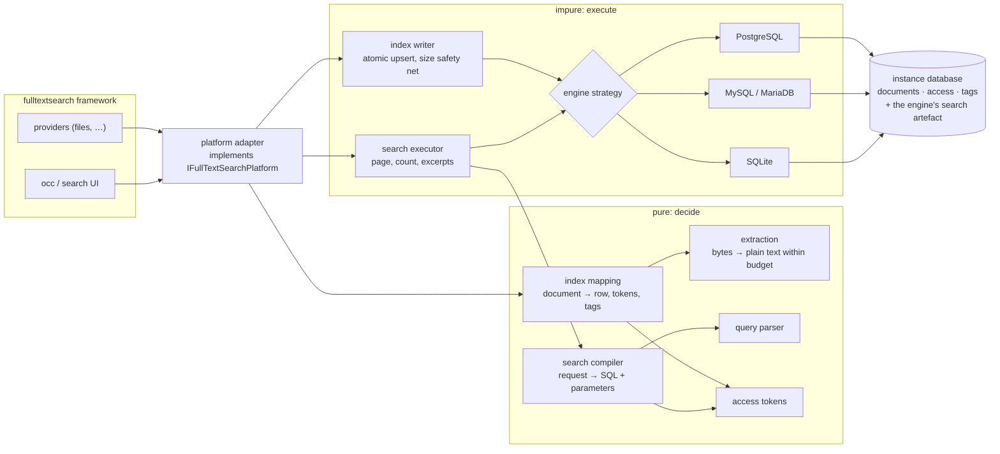
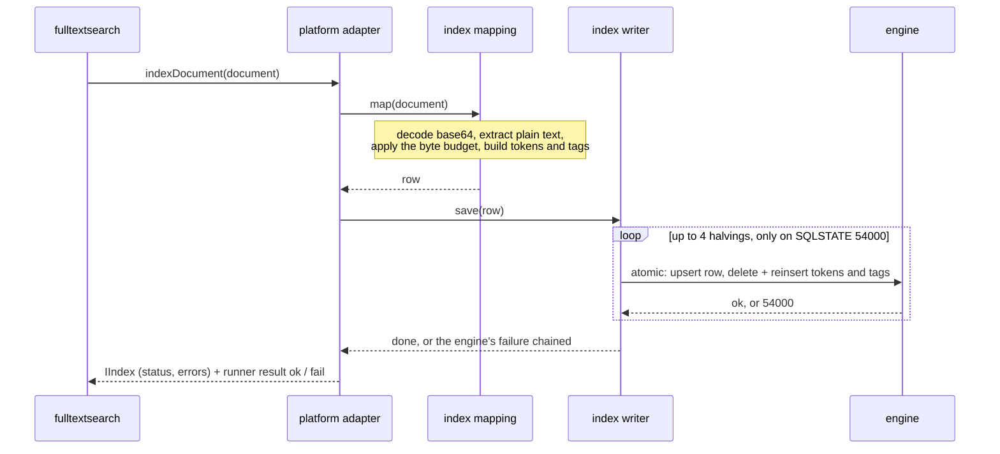

<!--
SPDX-FileCopyrightText: 2026 Néfix Estrada

SPDX-License-Identifier: AGPL-3.0-or-later
-->

# FTS SQL

## Metadata

- **Author**: Néfix Estrada (<nefixestrada@gmail.com>)
- **Created**: 2026-09-15
- **Status**: Implemented — milestones 1–4 complete, benchmarked and integration-tested on all four engines; the open-issues section below is closed with its resolutions registered
- **Approvals**: none yet

## Objective

Give a Nextcloud instance full text search over the database it already runs — PostgreSQL, MySQL/MariaDB or SQLite — so that nobody has to operate Elasticsearch to get it.

## Background

Nextcloud's full text search is a framework, the `fulltextsearch` app. It owns the content providers (`files_fulltextsearch` and others), the `occ fulltextsearch:*` commands, the search UI and the scheduler. What it does not own is the index: that is a *platform*, an app that implements `OCP\FullTextSearch\IFullTextSearchPlatform` and is handed each document to index and each search to answer. The platform Nextcloud ships is Elasticsearch, which means a second service, a JVM and a Tika extractor to run and keep patched — a cost out of proportion for a small or medium instance, single-server, with tens of thousands of documents. That instance is this design's target.

A community SQL platform already exists: [`jplitza/fulltextsearch_sql`](https://github.com/jplitza/fulltextsearch_sql) (AGPL-3.0, v1.3.6, Nextcloud 31–34, MySQL and PostgreSQL only). Its own manifest says it cannot index office formats and warns that the database "can easily grow hundreds of megabytes or even gigabytes", because it stores the content twice. Reading it found two more defects: it applies no length limit at all over a GIN index, so any document past PostgreSQL's `tsvector` ceiling (1,048,575 bytes, SQLSTATE `54000`) fails its `INSERT` outright; and it branches on the engine inline, `switch ($this->db->getDatabaseProvider())` fifteen times across four files.

Rather than assume what the three engines do, this project measures them first, with a permanent benchmark that indexes a fixed corpus — 5,000 Wikipedia opening paragraphs, a third each in Catalan, Spanish and English — through one interface on all three, and scores them on query sets whose answers are known by construction. The first runs found defects that only appear under measurement: with no deterministic `ORDER BY` tiebreaker, a MariaDB document moved from last to third between two runs of an identical query; InnoDB's `FULLTEXT` index served stale results after a bulk load until the server ran with `--innodb-optimize-fulltext-only=1`; and PHP Snowball stemming costs roughly 100× the indexing time (0.96 s against 159.8 s for 5,000 documents on SQLite). Each of those shaped a decision below.

Throughout this document, the **search artefact** is whatever an engine needs beyond portable tables to answer a full text query: a `tsvector` column with a GIN index on PostgreSQL, an InnoDB `FULLTEXT` key on MySQL/MariaDB, an FTS5 virtual table with triggers on SQLite.

## Related documents

- The incumbent SQL platform, whose defects this design answers: <https://github.com/jplitza/fulltextsearch_sql>

## Goals

- A Nextcloud instance has full text search with no service beyond the database it already runs.
- A user never sees a search result they could not open: the access filter fails closed.
- Every way the index can silently go wrong is reported where the administrator already looks — the admin screen and the output of the `occ` command they just ran — rather than by an empty result page.
- One bad document costs that document, never the indexing run.
- What each engine actually does is measured before it is relied on, and the measurements are kept, so a later change can be compared against them.
- In later milestones: a user finds an office document or a PDF by its body text, on an instance with no external service and no external binary.

## Non-goals

Never in scope:

- **OCR.** No pure-PHP implementation exists, and Tika only has it by shelling out to Tesseract; it falls with the binary ban below.
- **External services or binaries** — Tika, `pdftotext`, Tesseract. "No extra infrastructure" is the whole value proposition; Composer libraries are allowed and bundled.
- **Oracle.** The app manifest schema's `databases` enumeration admits only `sqlite`, `mysql` and `pgsql`, so Oracle cannot even be declared and is excluded by construction.
- **A reusable search library.** This is a platform implementing one interface for one framework.
- **Per-document language detection.** Language is one instance-wide setting that only PostgreSQL uses; documents in another language go through the wrong stemmer, and that cost is stated rather than hidden.
- **Honouring the framework's `__all` member as "everyone".** See Security; the identity reading is the one that cannot leak.

Not in the first milestone, each a later one (see Timeline):

- Content extraction beyond plain text.
- PHP stemming on MySQL/MariaDB and SQLite — measured at ~100× the indexing cost.
- Native excerpts (`ts_headline`, `snippet()`) — MySQL has neither, so excerpts are cut in PHP identically on all engines.
- The search request's *widening* capabilities (`getParts()`, `getWildcardFields()`, `getFields()`) — logged and skipped; the result is narrower, never wider.
- The benchmark's scale and access-filter stages; the first milestone ships with its quality stage only.

## Scenarios

### Scenario 1: an administrator turns search on

1. Anna administers a Nextcloud 34 on PostgreSQL 16 for a school. She installs `fulltextsearch`, `files_fulltextsearch` and FTS SQL.
2. Under Administration settings → Full text search she selects the platform named "SQL". The FTS SQL card on the same page reads "Ready: the search index exists in this PostgreSQL database".
3. She picks `catalan` as the text search configuration on that card, and reads next to the `<select>` that changing it later invalidates every indexed document.
4. She runs `occ fulltextsearch:index`. Each document prints `ok` or `fail`.
5. A teacher, Biel, types *corrents* into the search bar and finds a document that only contains *corrent*, because PostgreSQL's Catalan configuration stems both to the same lexeme (measured on PostgreSQL 16.10: `to_tsvector('catalan', …)` gives `'corr'` for either word).

### Scenario 2: a share decides who finds what

1. Biel uploads `sortida-museu.txt` and shares it with the group `professorat`.
2. Carla, in `professorat`, searches *museu* and finds it: the document's access tokens include `g:professorat`, and her viewer tokens include the same string.
3. Dani, a student, searches *museu* and gets nothing: none of his tokens (`o:dani`, `u:dani`, `g:alumnat`) is stored against the document.

### Scenario 3: the app is disabled and re-enabled

1. Anna runs `occ app:disable fts_sql && occ app:enable fts_sql` on the PostgreSQL instance from Scenario 1.
2. The repair step re-creates the artefact and prints that the index does not hold every document the app has stored, because creating it does not refill it.
3. The admin card stops saying "Ready" and shows the same warning with the repair: `occ fulltextsearch:reset && occ fulltextsearch:index`.
4. Had the instance been on SQLite, step 2 would have printed nothing: its artefact statements end in an FTS5 `rebuild`, which refills the index from the document table.

### Scenario 4: a document the engine refuses

1. Eli uploads a `.csv` of UUIDs larger than the 2 MiB budget. `files_fulltextsearch` hands the bytes to the platform, base64-encoded.
2. The platform accepts it as plain text and cuts it to the budget on a word boundary.
3. PostgreSQL refuses the `tsvector` with SQLSTATE `54000`, because a text where every token is distinct hits the 1,048,575-byte ceiling at roughly 637 KB.
4. The platform halves the content and retries, up to four times, and the row lands truncated. The document is findable by what survived; its `IIndex` carries the error and `occ fulltextsearch:index` prints `ok`.

## Diagrams

Component fit. The two boxes are the boundary the test tiers follow: everything on the pure side decides and is unit-tested standalone; everything on the impure side executes and is tested against a real Nextcloud on each engine.



The write path, where the PostgreSQL safety net lives:



## Code organisation

The diagram's boxes map onto classes one to one. The rule that decides where a class goes is the one the benchmark taught: **deciding is pure, executing is impure**, and a class that holds the connection never composes SQL text while a class that composes SQL text never holds the connection. The Elasticsearch platform already splits `IndexService` from `IndexMappingService` and `SearchService` from `SearchMappingService` for the same reason; the names are kept so a reader of one platform recognises the other.

```text
lib/
  AppInfo/Application.php           registers the one listener the streaming fast path needs; a platform is declared in info.xml
  ConfigLexicon.php                 the two config keys, their types and defaults
  Platform/SqlPlatform.php          implements IFullTextSearchPlatform; thin, one hand-off per method

  Service/ExtractionService.php     pure   bytes + title → plain text within the budget, or null
  Service/IndexMappingService.php   pure   IIndexDocument → IndexRow (row, tokens, tags, extraction outcome)
  Service/SearchMappingService.php  pure   ISearchRequest + IDocumentAccess → CompiledSearch (SQL text, parameters)
  Service/ConfigService.php         typed reads of the two keys
  Service/IndexService.php          impure writes an IndexRow atomically; owns the 54000 safety net and the deletes
  Service/SearchService.php         impure runs a CompiledSearch; pages, counts, excerpts; the health probe

  Backends/IBackend.php             the engine strategy (below)
  Backends/BackendFactory.php       IDBConnection::getDatabaseProvider() → one IBackend, or refuses
  Backends/Postgres.php
  Backends/Mysql.php
  Backends/Sqlite.php

  Model/SearchQuery.php             parse(string): list<QueryTerm>; the 64-term cap lives here
  Model/QueryTerm.php               value, phrase?, Occur
  Model/Occur.php                   enum Should | Must | MustNot
  Model/DocumentAccess.php          IDocumentAccess → tokens, both directions
  Model/IndexRow.php                what one document becomes: columns, tokens, tags, contentExtracted, contentError
  Model/CompiledMatch.php           predicate, rank, join, parameters — one engine's answer for one query
  Model/CompiledSearch.php          page SQL, count SQL, parameters — ready to execute
  Model/AccentFold.php              the folding table PostgreSQL and MySQL need applied in PHP

  Migration/Version<date>.php       the three portable tables, through ISchemaWrapper
  Migration/CreateSearchArtefact.php IRepairStep under <install> and <post-migration>; runs the strategy's DDL

  Settings/Admin.php                ISettings; computes the three card states
  Controller/SettingsController.php the two OCS endpoints
  Exceptions/                       AccessIsEmpty, ContentTooLarge, UnsupportedCapability, UnsupportedEngine
```

`Backends/` rather than `Databases/`: `Database` would collide with `IDBConnection` in every reader's head, and `serverinfo/lib/OperatingSystems/` — `IOperatingSystem` with `Linux`, `FreeBSD`, `Dummy` — is the precedent for a per-variant strategy directory named for the domain concept.

Three consequences of the split are requirements:

- The two `*MappingService` classes and everything under `Model/` take no `IDBConnection` and return strings or value objects. A unit test asserts the exact SQL text and parameters a request compiles to, with no database anywhere.
- A strategy returns strings too, with exactly two named exceptions that read the engine: the capability probe, and MySQL's catalogue check before its non-idempotent `ADD FULLTEXT INDEX`. Anything else a strategy wants to know, it is told.
- Every other statement that executes against an engine lives in `IndexService`, `SearchService`, `CreateSearchArtefact` or `Settings\Admin`, which is the list the integration tier runs on all four engines.

## Constraints

- **Nextcloud 34 exactly**, PHP ≥ 8.2, PostgreSQL ≥ 14, MySQL/MariaDB ≥ 10.6 — a number that only makes sense as MariaDB, since the manifest cannot tell the two apart.
- **SQLite's FTS5 is a compile-time option** of whatever `pdo_sqlite` the host provides. It cannot be declared as a dependency; it has to be probed at runtime, and the app refuses to index without it.
- **Nextcloud's rule against raw SQL** holds everywhere except the engine strategies: no search artefact is expressible through `ISchemaWrapper`, so the portable tables go through the migration API and the artefact DDL is confined to one class per engine.
- **`mbstring` is required by Nextcloud; `intl` is only recommended.** Nothing may depend on `intl` — the budget cut is `mb_strcut()` and the word-boundary trim is PCRE `/u`.
- **Table names ≤ 23 characters**, `BIGINT` autoincrement primary keys (Galera), per the developer manual.
- **Nextcloud's documented `memory_limit` floor is 512 MB.** Any extractor has to fit under it together with the rest of the PHP process, which is what makes the PDF route an open issue.
- **InnoDB's `innodb_ft_min_token_size = 3` and its 36-word stopword list** (`a`, `de`, `en`, `i`, `la`, `of`, `the`, `to` among others — read off MySQL 8.4.6 and MariaDB 11.4.7, which agree) cannot be changed from an app: they are server variables that need a restart and a `FULLTEXT` rebuild. Short and common words in Catalan and Spanish silently match nothing on those engines: over `la casa de la muntanya el pis`, `el`, `la*` and `+de +casa` all find nothing while `+casa` finds the row.
- **`max_allowed_packet`** was measured at 16 MB on MariaDB 11.8.8; exceeding it drops the connection rather than raising. The 2 MiB default budget sits well below it, so the constraint binds only an administrator who raises the budget past it.

## Monitoring / alerting

Nothing pages anyone; this is an app inside someone else's instance. Every failure mode below raises no error when it bites — a search just comes back empty — so each is given a place where it is seen:

| What went wrong | How it is seen |
| --- | --- |
| The engine cannot search at all (SQLite without FTS5) | the strategy's runtime probe → admin card "this SQLite build cannot run full text search"; the repair step prints the same warning |
| The artefact is missing (the install repair step failed and `Repair::run()` swallowed it) | the admin card and `testPlatform()` both compile the platform's own predicate and make the engine run it; a missing column, index or table raises instead of returning no rows |
| The artefact exists but predates the rows (disable/enable, upgrade) | the strategy answers "are there rows the artefact cannot find" → admin card state and repair-step warning naming `occ fulltextsearch:reset && occ fulltextsearch:index` |
| A document failed to index | `IIndex::INDEX_FAILED` plus `addError()` on the document; `IRunner::newIndexResult()` prints `fail` in `occ fulltextsearch:index`; a `warning` in the Nextcloud log |
| A document was indexed without its content (format not extracted, base64 that does not decode) | `IIndex::INDEX_CONTENT` unset and an error at `ERROR_SEV_1` (expected) or `ERROR_SEV_3` (a provider bug) |

## Timeline

Ordered so that each milestone is usable on its own and never blocked by the next one's unknowns: the platform first, because every extractor needs somewhere to put text; the formats that need no library next; the bundling tooling only when the first library arrives. No dates have been committed to.

### Milestone 1: platform core, plain text

Observable state: an instance on any of the three engines indexes `.txt`, `.md`, `.csv`, `.log` and other plain text, searches them with access filtering, and reports its own health on the admin card. Any other format is indexed by title, access and tags only, with an error at the quietest severity naming it.

Delivers everything under Interfaces. Does not deliver any content extraction.

### Milestone 2: OOXML and ODF

Observable state: `.docx`, `.xlsx`, `.pptx`, `.odt`, `.ods` and `.odp` are found by their body text.

Delivered with the project's own `XMLReader` extractors: PhpSpreadsheet measured at +595.9 MiB and 31.8 s on a 1.09 MiB `.xlsx` where a targeted `XMLReader` pass cost +0.3 MiB and 1.0 s for byte-identical output. Does not deliver any bundled library.

### Milestone 3: the bundling tooling, then PDF

Observable state: bundled Composer dependencies live under the app's own namespace, rewritten by `php-scoper` — the pattern `fulltextsearch_elasticsearch` already uses, because two apps bundling different versions of the same namespace means whichever autoloader registers first wins, silently; then `.pdf` is found by its body text.

The order inside the milestone is fixed: retrofitting namespace prefixing after libraries are in is worse than doing it once. The PDF route resolved to the project's own extractor — see Resolved issues.

### Milestone 4: legacy binary Office

Observable state: `.ppt`, `.xls` and `.doc` are found by their body text, in that order, on PhpOffice readers with known caveats: the `.doc` piece table is missing from PhpWord, and `.xls` inherits PhpSpreadsheet's memory profile.

### Not sequenced

The benchmark's scale stage (100k and 1M documents), its access-filter stage and the comparison those produce have no place in the format order and depend on none of it.

## Interfaces

### The framework contract

One class implements `OCP\FullTextSearch\IFullTextSearchPlatform` and is the only thing the framework calls. It is deliberately thin — each method hands off to one service:

| Method | What it does here |
| --- | --- |
| `getId()`, `getName()` | `fts_sql`, "SQL" — the name an admin picks from the platform list |
| `getConfiguration()` | engine, language and budget, for the framework's own panel |
| `loadPlatform()`, `initializeIndex()` | nothing: the database is already connected, the artefacts are created by the repair step |
| `testPlatform()` | compiles the platform's own search predicate and makes the engine run it |
| `indexDocument()` | map, then write; catches `\Throwable`, never `\Exception` — a parser's `TypeError` is a `Throwable` |
| `searchRequest()` | compile, execute, page, count, excerpt |
| `getDocument()` | rebuilds an `IIndexDocument` from the stored row, for `occ fulltextsearch:document:platform` |
| `resetIndex()` | `'all'` is the framework's word for a global reset, otherwise one provider |
| `deleteIndexes()` | one delete per `(provider_id, document_id)` |
| `setRunner()` | progress reporting into `occ fulltextsearch:index` |

### The engine strategy

One class per value of `IDBConnection::getDatabaseProvider()`, selected once per request:

```php
interface IBackend {
	public function name(): string;
	public function isUsable(): bool;
	/** the :cfg names this engine itself accepts, read live from its catalogue; simple only where none applies */
	public function textSearchConfigurations(): array;
	/** @return list<string> DDL, idempotent */
	public function artefactStatements(): array;
	public function hasUnindexedDocuments(): bool;
	/** SET assignments over :title, :content and :cfg; '' when the engine maintains the artefact itself */
	public function contentExpression(): string;
	public function normaliseText(string $text): string;
	public function matchExpression(SearchQuery $query, string $language): CompiledMatch;
}

final readonly class CompiledMatch {
	public function __construct(
		public string $predicate,   // a WHERE fragment over the alias d
		public string $rank,        // higher is better; SQLite negates bm25() to comply
		public array $parameters,   // what predicate and rank bind
		public string $join = '',   // appended to FROM; only SQLite needs one
	) {
	}
}
```

Each strategy owns exactly seven things and nothing else; most return strings and execute nothing:

1. **A capability probe** — whether this engine can serve full text search here (SQLite: is FTS5 compiled in). Reads the engine.
2. **The text search configurations** — the names this engine itself accepts as `:cfg`, read live from its own catalogue: PostgreSQL answers `pg_catalog.pg_ts_config` (a set that grows with the engine — measured on live servers: 16 names on 9.6–11, `catalan` only since 14, `estonian` new in 18), the other engines take no configuration and answer `simple` only. Reads the engine.
3. **The artefact DDL** — idempotent, because install repair steps run on every `occ app:enable`. Reads the catalogue on MySQL, whose `ADD FULLTEXT INDEX` has no `IF NOT EXISTS`.
4. **"Are there rows the artefact cannot find"** — the state that creating an artefact over existing rows leaves behind. Deliberately not "is the artefact empty": an empty index over an empty table is a healthy fresh install.
5. **The write expression** — the `SET` assignments that fill the artefact from `title` and `content`, with the language as a bound parameter; empty where the engine maintains the artefact itself.
6. **PHP-side normalisation** — the folding the engine's tokeniser lacks, applied to what feeds the artefact and to the query, never to the stored text an excerpt is cut from.
7. **Match compilation** — the predicate, the ranking expression, any join, and the bound parameters for one parsed query.

| Engine | Artefact | Filled by | PHP normalisation |
| --- | --- | --- | --- |
| PostgreSQL | `content_tsv tsvector` + GIN index with `fastupdate = off` (with it on, index size depends on when the pending list was last flushed) | `setweight(to_tsvector(:cfg, title), 'A') \|\| setweight(to_tsvector(:cfg, content), 'B')` | accent folding; `to_tsvector` does not |
| MySQL/MariaDB | `title_norm`, `content_norm` `LONGTEXT` + `FULLTEXT` index over both, boolean mode | the two `_norm` columns | accent and case folding; a `FULLTEXT` index over `utf8mb4_bin` folds neither on the query side |
| SQLite | FTS5 virtual table with **external content** over the documents table, `unicode61 remove_diacritics 2`, plus insert/update/delete triggers, and a `rebuild` at the end of the DDL | the triggers | none |

The language is a bound parameter, not a generated column or a trigger: both bake it into the schema, and here it is an admin setting.

### Schema

Three portable tables through the migration API:

| Table | Columns | Indexes |
| --- | --- | --- |
| `fts_sql_documents` | `id`, `provider_id`(64), `document_id`(255), `owner`(64), `title` TEXT, `content` TEXT with **no length** (a length makes Doctrine pick MySQL `TEXT`, 65,535 bytes, below the budget; without one it emits `LONGTEXT`), `link` TEXT, `source`(64), `modified` BIGINT, `hash`(64) | unique `(provider_id, document_id)` |
| `fts_sql_access` | `id`, `doc_id`, `token`(96) | `(token, doc_id)`, `(doc_id)` |
| `fts_sql_tags` | `id`, `doc_id`, `kind`(16), `value`(128) | `(kind, value, doc_id)`, `(doc_id)` |

The engine's artefact is created by one `IRepairStep`, declared under both `<repair-steps><install>` and `<repair-steps><post-migration>`. A migration's `postSchemaChange()` covers neither: a fresh install goes through `MigrationService::migrateSchemaOnly()`, which applies every `changeSchema()` and marks the migrations executed without ever calling `postSchemaChange()`, and an upgrade then runs only pending migrations, so the hook never fires on any install that ever existed. The `install` step reaches a first install and every `occ app:enable`; the `post-migration` step reaches an upgrade. Both are the same class, so a future artefact change ships with a version bump.

Writes are one transaction (`TTransactional::atomic()`) that replaces the document: delete any row with the same `(provider_id, document_id)` together with its tokens and tags, insert the new row, fill the artefact, insert tokens and tags. A replace rather than an upsert, because it is one shape on three engines and nothing outside the app references `id`, so a fresh id per reindex costs nothing; and a replace rather than a diff of the token set, because the common case is an ACL change and comparing two small sets costs more code than it saves. The worked example under Interfaces shows the sequence.

### Access tokens

`IDocumentAccess` is used on both sides — a document's ACL at index time, a viewer's memberships at search time — so it is mapped onto flat strings in both directions and the filter is one set intersection on every engine:

```sql
EXISTS (SELECT 1 FROM oc_fts_sql_access a WHERE a.doc_id = d.id AND a.token IN (:tokens))
```

Tokens are `o:<owner>`, `u:<user>`, `g:<group>`, `c:<circle>`. A document with no owner, or a viewer with no identity, is refused rather than producing an empty token set: a document nobody can find is either useless or a permission bug that would otherwise pass silently. There is no token meaning "anyone".

The token table rather than JSON columns per access kind (the incumbent's shape): JSON is indexable only on PostgreSQL — MySQL needs multi-valued indexes absent in MariaDB, SQLite needs expression indexes over JSON1 — and the token table is one query on all three.

### Query syntax

The same syntax as the Elasticsearch platform, because that is what users already have in their fingers: whitespace-separated terms, `"quoted phrases"`, `+required`, `-excluded`; by default an OR of terms with a prefix match on the last unquoted optional term (`:*` on PostgreSQL, `token*` on MySQL and FTS5). At most 64 terms, truncated from the front: measured on the 5,000-document corpus with every document matching, 64 terms cost 564 ms and 1,024 terms 159 s on PostgreSQL, because `ts_rank_cd` ranks every matching row against every term before the `LIMIT`. Invalid UTF-8 is substituted, never dropped: `preg_match_all` with `/u` matches nothing at all on an invalid byte, which would parse a non-empty query as empty and send the statement out without its match predicate.

Ordering is always `ORDER BY score DESC, id ASC`. With `LIMIT`/`OFFSET` an unstable sort puts a document on two pages or on neither, and MariaDB's boolean-mode scores are exact multiples of a base value, so ties are the norm there.

### Worked example: one search on each engine

Carla (groups `professorat`) is on page 2 of the files search, 20 results per page, and typed:

```text
+museu "sortida escolar" -pis mun
```

The parser produces four terms, in order:

| Term | `phrase` | `occur` | Note |
| --- | --- | --- | --- |
| `museu` | no | Must | |
| `sortida escolar` | yes | Should | quotes stripped, inner whitespace collapsed |
| `pis` | no | MustNot | |
| `mun` | no | Should | last unquoted optional term → prefix match |

The search compiler builds one statement shell that every engine shares. The strategy supplies only the three placeholders and its parameters:

```sql
SELECT d.id, d.document_id, d.title, d.content, d.link, <rank> AS score
FROM oc_fts_sql_documents d <join>
WHERE d.provider_id = :provider
  AND EXISTS (SELECT 1 FROM oc_fts_sql_access a WHERE a.doc_id = d.id AND a.token IN (:tokens))
  AND <predicate>
ORDER BY score DESC, id ASC
LIMIT :limit OFFSET :offset
```

with `:provider = 'files'`, `:tokens = ['o:carla', 'u:carla', 'g:professorat']`, `:limit = 20`, `:offset = 20`. The count that feeds `setTotal()` is `SELECT COUNT(d.id)` over the identical `FROM … WHERE …`, so it can never page over a set the page query does not see. A ticked source checkbox adds `AND EXISTS (SELECT 1 FROM oc_fts_sql_tags t WHERE t.doc_id = d.id AND t.kind = 'meta' AND t.value IN (:metatags))` to both.

What each strategy returns for those four terms:

**PostgreSQL** — `:cfg = 'catalan'`; every word is accent-folded first, phrases join their words with `<->` (what `to_tsquery` itself does to a token it splits), the optional terms are parenthesised as one operand before anything is required or excluded of them, because `&` and `!` bind tighter than `|`:

```text
predicate  content_tsv @@ to_tsquery(:cfg::regconfig, :query)
rank       ts_rank_cd(content_tsv, to_tsquery(:cfg::regconfig, :query))
join       (none)
:query     (sortida <-> escolar | mun:*) & museu & !(pis)
```

`to_tsquery(regconfig, text)` is `IMMUTABLE`, so PostgreSQL folds both calls into one constant while planning; the cost that remains is `ts_rank_cd` once per matching row, which is what the 64-term cap bounds.

**MySQL/MariaDB** — every word is accent-folded and lowercased, because the `_norm` columns hold that form; boolean mode's own operators (`+ - > < ( ) ~ * " @`) are stripped from the user's text before this app's own are put around it, since a malformed boolean query is ERROR 1064, the same code as broken SQL:

```text
predicate  MATCH(title_norm, content_norm) AGAINST(:query IN BOOLEAN MODE)
rank       MATCH(title_norm, content_norm) AGAINST(:query IN BOOLEAN MODE)
join       (none)
:query     +museu "sortida escolar" -pis mun*
```

A `*` inside quotes is a literal on this engine, so a phrase never takes the prefix operator. `pis` and `mun` are exactly `innodb_ft_min_token_size` long, the shortest word InnoDB stores; `de` or `el` in the same position would silently match nothing.

**SQLite** — every token goes in as an FTS5 string literal with inner quotes doubled, which is what stops `C++`, `report.pdf` or `AND` being read as syntax; `NOT` is binary in FTS5, so exclusions are appended after the positive expression, and a query that is nothing but exclusions gets the empty literal `""` to subtract from, which matches no row:

```text
predicate  fts_sql_fts MATCH :query
rank       -bm25(fts_sql_fts)
join       JOIN fts_sql_fts ON fts_sql_fts.rowid = d.id
:query     ("sortida escolar" OR "mun"*) AND "museu" NOT "pis"
```

The join is not optional and the table cannot be aliased: `bm25()` is an auxiliary function that resolves only against a table already in the query, by name. Ranked through a subquery instead, SQLite re-runs the whole match once per candidate row — measured over 20,000 documents, one word in the search box: 230 s against 59 ms. `bm25()` is negative and more negative is better, so it is negated to satisfy the shared `ORDER BY score DESC`.

Each row that comes back becomes an `IIndexDocument` with its title, link, score and an excerpt: 200 characters of the stored content, starting 40 characters before the first case-insensitive occurrence of the search text with the operators stripped, or from the start when there is none.

Two degenerate shapes of the same statement: an **empty search box** compiles no predicate, `0` as rank and no join — a browse of what the viewer may see, ordered by id; and the **health probe** is `SELECT 1 FROM oc_fts_sql_documents d <join> WHERE <predicate> LIMIT 1` for a word no document holds, which answers "no rows" through a working artefact and raises through a missing one.

### Worked example: indexing one document

`files_fulltextsearch` hands over a document with title `Escola/Sortida al Museu de Ciències.txt` (the path, which is where the extension is read from), content in base64, owner `biel`, groups `['professorat']`, metatag `files_local`. Mapping, all pure:

1. Decode. If the provider flagged base64 and the bytes do not decode, the document is still indexed on its title, access and tags, without content and with an error at ordinary severity — a transport bug, not this app's.
2. Extract: the extension is not on the deny-list of formats later milestones own (`docx`, `pdf`, `zip`, images …), the bytes are valid UTF-8 with no control character outside tab, newline and carriage return — so it is plain text. Cut to `content_bytes` with `mb_strcut()` and drop the trailing partial word. A `.docx` here yields `null`: the row is still written, with empty content, `IIndex::INDEX_CONTENT` unset and an error naming the format.
3. Tokens: `['o:biel', 'g:professorat']`. Tags: `[['meta', 'files_local']]`.

Writing, in one transaction, on PostgreSQL:

```sql
-- replace: whatever the previous version of this document left behind
DELETE FROM oc_fts_sql_access    WHERE doc_id IN (SELECT id FROM oc_fts_sql_documents WHERE provider_id = :p AND document_id = :d);
DELETE FROM oc_fts_sql_tags      WHERE doc_id IN (…the same…);
DELETE FROM oc_fts_sql_documents WHERE provider_id = :p AND document_id = :d;

-- the portable row, through the query builder
INSERT INTO oc_fts_sql_documents (provider_id, document_id, owner, title, content, link, source, modified, hash)
VALUES (:p, :d, :owner, :title, :content, :link, :source, :modified, :hash);

-- the artefact, through the strategy's contentExpression(); :title and :content are normaliseText()'s output
UPDATE oc_fts_sql_documents
SET content_tsv = setweight(to_tsvector(:cfg::regconfig, COALESCE(:title, '')), 'A')
               || setweight(to_tsvector(:cfg::regconfig, COALESCE(:content, '')), 'B')
WHERE id = :id;

INSERT INTO oc_fts_sql_access (doc_id, token)       VALUES (:id, 'o:biel'), (:id, 'g:professorat');
INSERT INTO oc_fts_sql_tags   (doc_id, kind, value) VALUES (:id, 'meta', 'files_local');
```

`:title` is `Escola/Sortida al Museu de Ciencies.txt` — accent-folded, case kept, because `to_tsvector` lowercases itself but does not fold accents. The `COALESCE` is what guarantees a row written through this app always has a `tsvector`, even with an empty title and content, so that `content_tsv IS NULL` means exactly one thing: the row predates the artefact.

On MySQL/MariaDB the `UPDATE` is instead:

```sql
UPDATE oc_fts_sql_documents SET title_norm = :title, content_norm = :content WHERE id = :id;
```

with `:title` = `escola/sortida al museu de ciencies.txt` — folded and lowercased, because an InnoDB `FULLTEXT` index over `utf8mb4_bin` folds neither on the query side. InnoDB maintains the index from those columns itself.

On SQLite there is no `UPDATE` at all: the `AFTER INSERT` trigger on `oc_fts_sql_documents` writes the row into `fts_sql_fts`, the `AFTER DELETE` trigger took the previous one out, and `unicode61 remove_diacritics 2` folds accents and case inside the tokeniser, so `normaliseText()` is the identity.

If PostgreSQL answers the `UPDATE` with SQLSTATE `54000`, the transaction is rolled back, the content is halved and the whole sequence runs again, up to four times — four halvings take 2 MiB below 132 KB, well under the ~637 KB adversarial wall. Any other failure is rethrown at once: retrying a syntax error or a lost connection would only make a fast failure slow.

### What the search honours, by direction

The framework's `ISearchRequest` is wider than any SQL platform can serve, and the useful distinction is not "supported or not" but which way being wrong goes:

| Capability | Direction | Behaviour |
| --- | --- | --- |
| `getMetaTags()` | narrows | honoured, as a disjunction over tag rows of kind `meta` — `files_fulltextsearch` sends one tag per ticked source and a file has exactly one source, so a conjunction would match nothing |
| `getLimitFields()` | narrows | honoured when it names both `title` and `content`; a proper subset refuses (MySQL answers `MATCH(title)` against the composite index with ERROR 1191) |
| the unified search's Date chip (`options` `since`/`until`) | narrows | honoured as a range over the stored `modified`, on every engine — the one user-visible option, and left unserved it was a silent widening |
| `getRegexFilters()`, `getWildcardFilters()`, `getSubTags()`, `getSimpleQueries()` | narrow | refuse, and say so: ignoring them would return documents the user excluded |
| `getWildcardFields()`, `getParts()`, `getFields()` | widen | logged at `debug` and skipped; `files_fulltextsearch` sends the first two on every search, so refusing them would serve no query at all |

### Configuration

Two app config keys, declared through a config lexicon:

| Key | Type | Default | Meaning |
| --- | --- | --- | --- |
| `language` | string, one of the text search configurations the running PostgreSQL itself reports in `pg_catalog.pg_ts_config` (read live; the set grows with the engine — 16 names on PostgreSQL 9.6–11, 30 on 18) | `simple` | PostgreSQL text search configuration; `simple` disables stemming; other engines ignore it |
| `content_bytes` | int | `2097152` (2 MiB) | extracted plain text stored per document, in bytes |

The budget is bytes of extracted text, not file size, which `files_fulltextsearch` gates upstream at 20 MB. For intuition: one page of PDF prose is about 2.8 KB of text, the corpus median is 915 bytes and its p99 4,556 bytes, and the entire 756-page ISO 32000-1 specification is 2.05 MB — so 2 MiB indexes roughly 760 pages per document. Nextcloud's Elasticsearch platform overrides Tika's 100,000-character limit to unlimited, which is why the budget is generous rather than conservative. The cut is `mb_strcut()` (byte-denominated, sequence-safe — `substr()` splits multi-byte sequences and `mb_substr()` counts characters), followed by trimming the trailing partial word.

Two OCS endpoints, admin-only by the framework's default posture: `PUT /settings/content-bytes` refuses a non-positive value; `PUT /settings/language` refuses anything outside what the running engine itself reports (`pg_catalog.pg_ts_config`, read through the strategy), because a configuration name the engine below lacks would make every PostgreSQL write fail.

| Privilege | Administrator | Any user |
| --- | --- | --- |
| Change `language` or `content_bytes` | ✅ | ❌ |
| See the FTS SQL admin card | ✅ | ❌ |
| Search | ✅ | ✅ (own tokens only) |

### Admin card

A card inside the framework's own Full text search settings section, after the Elasticsearch platform's. It renders the first of three states that fails — the engine cannot search, the artefact is missing, the artefact does not hold every document — or "Ready", and carries the two settings with their warnings next to the control, not after Save: on PostgreSQL, `content_tsv` is stemmed with the configuration in force at write time and the query with the one in force now, so a changed language stops every indexed document from matching (measured on PostgreSQL 16, both directions: `to_tsvector('simple', 'els corrents del riu') @@ to_tsquery('catalan', 'corrents')` is false, and so is the swapped pair). The `<select>` offers exactly what the running engine reports, and names each language by its endonym — Nextcloud's own convention for language pickers, invariant of the viewer's locale, so the names carry no msgids — while storing the configuration name; `simple` is not a language and has no endonym, and shows as its own name.

## Dependencies / infrastructure

### Language: PHP 8.2, Vue 3 for the admin card

Fixed by Nextcloud; not a choice. The card is the only frontend and could be replaced by a plain template in an afternoon.

### Storage: the instance's own database

The point of the project, so not swappable by definition. What *is* kept swappable is the engine: every engine-specific line sits behind the strategy, and adding one is one class.

### Framework: the `fulltextsearch` app

The one dependency that shapes everything, through `IFullTextSearchPlatform` and `ISearchRequest`. Its `files_fulltextsearch` provider decides which capabilities arrive on every search, which is why the direction rule exists.

### Runtime libraries: none in Milestone 1

Milestone 3 adds none either — its PDF route resolved to the project's own extractor — so the php-scoper tooling waits, proven by its self-test, for Milestone 4's PhpOffice readers (LGPL-3.0, PhpSpreadsheet MIT), all compatible with AGPL-3.0-or-later and to be rewritten under the app's namespace by `php-scoper`.

### Verification: two tiers, four engines

A unit tier that runs standalone against the published `nextcloud/ocp` package, with zero uncovered lines over the pure side of the diagram — a percentage quietly tolerates a growing tail of untested code. An integration tier that installs a real Nextcloud against SQLite, PostgreSQL 16, MariaDB 11.4 and MySQL 8.4 from the official `continuous-integration-*` images and runs the impure side there. Every raw SQL statement is on the impure side and is exercised on every engine.

## Security

### Attack surface

1. **Document bytes handed to `indexDocument()`.** Provider-supplied, ultimately uploaded by anyone who can write to a share. In Milestone 1 they are only ever tested for being plain text and cut to a budget; from Milestone 2 they are parsed, inside the Nextcloud PHP process that holds the database connection.
2. **The search string.** User input compiled into SQL by three strategies.
3. **The access filter.** The boundary between one user's documents and another's.
4. **Two OCS settings endpoints.** Administrator input into app config.
5. **Artefact DDL.** Constant strings; no input reaches them.

### Threats

**Permission leak through a reserved member.** Scenario: the framework reserves the member `__all` inside `getUsers()` to mean "everyone may read this", and `files_fulltextsearch` sets it for a fully global external mount. But `__all` is also a legal Nextcloud uid — `validateUserId()` accepts `a-zA-Z0-9`, space and `_.@-'` — and the reserved member and a real account arrive as the same string in the same flat list, with nothing on `IDocumentAccess` to tell them apart. Read as "everyone", a document shared with an account actually called `__all` emits the one token every viewer carries and becomes world-readable. Mitigation: only the identity reading is honoured; every token is an identity behind a prefix; empty identities are refused. Accepted risk: fully global external mounts are found only by whoever the rest of their ACL names — recall lost, deliberately, in the direction that fails closed.

**Injection through the search string.** Scenario: a query containing engine operators. Mitigation: every value is a bound parameter; each strategy splits terms on its own operator characters before composing the match (PostgreSQL on `[\s&|!()<>:*'\\]`, joining what survives with `<->`, which is what `to_tsquery` itself does to a token it splits); the query text never reaches SQL as text.

**Denial of service through the search string.** Scenario: a 128 KB request body compiled into a 14.9 KB `tsquery`, ranked against every matching row before the `LIMIT` — measured at 159 s for 1,024 terms. Mitigation: the 64-term cap, measured at 564 ms worst case on the corpus; it is deliberately not Elasticsearch's 1,024, which measured at 159 s here. Accepted: the cost stays linear in how many documents match, which is the corpus and not the request.

**Information leak through a dropped predicate.** Scenario: a stray invalid byte makes the parser see no terms, and the statement goes out with the access filter but no match predicate, answering with every document the viewer can see. Mitigation: invalid sequences are substituted, so a term always survives.

**Configuration that breaks every write.** Scenario: an administrator's value for `language` reaches `to_tsvector()` as a regconfig name. Mitigation: the offered list *is* the running engine's own `pg_catalog.pg_ts_config`, read live through the strategy and shared by the card, the endpoint and the read guard — a name can neither be offered that this engine lacks (the set varies: measured 16 configurations on PostgreSQL 9.6–11, `catalan` only since 14, `estonian` new in 18) nor be refused that it has. A value that reaches storage by other means than the endpoint heals to the default on read.

**Hostile documents parsed in-process — the milestones ahead.** Scenario: a crafted OOXML, zip or PDF. The traps were measured: `LIBXML_NOENT` reads as a safety flag and *substitutes* entities, leaking `/etc/passwd` (12,192 bytes) even with `LIBXML_NONET`, which does not cover `file://`; `XMLReader` with `SUBST_ENTITIES` false blocks it. Prescribed mitigations: never pass `LIBXML_NOENT`, set `libxml_set_external_entity_loader(fn () => null)` as defence in depth, ratio pre-check plus bounded incremental inflate for zip bombs, a visited set and depth cap on PDF object graphs, hard caps on bytes read, characters emitted, wall-clock and nesting, and `catch (\Throwable)` per document. Accepted for now: a pathological file costs one document. Whether extraction must be reachable from a background job only, never synchronously from a web request, is a stretch goal, not decided.

## Privacy

The app stores, in the instance database, a plain-text copy of every indexed document's extracted text up to `content_bytes`, plus its title, link, owner and the identities that may read it. On MySQL/MariaDB the folded `_norm` columns are a second copy; on PostgreSQL the `tsvector` is derived; on SQLite external content keeps no second copy. It inherits whatever protection the instance database has, and nothing here is encrypted separately. A row lives until the framework deletes the document or resets the provider. The Nextcloud log carries exception messages, not document text; whether a driver exception's message can embed a statement's bound values has not been checked.

## Legal considerations

AGPL-3.0-or-later, REUSE-compliant. The libraries the later milestones bundle are LGPL-3.0 and MIT, compatible with it; `php-scoper` modifies LGPL sources by rewriting namespaces, which LGPL permits and which the project satisfies by being source-available under a compatible licence.

## Logging

- `warning` — a document could not be indexed, with the exception, once per failed document.
- `debug` — a widening capability was ignored, once per capability per search.
- Repair-step output — the two warnings under Monitoring, into the `occ` command that ran it.
- Per document, on the `IIndex` rather than the log: the error message, the exception class, and a severity.

## Resolved issues

- **EPUB dropped from Milestone 2.** The draft listed `.epub` beside the office formats — a zip of XML that needs no library, like they do. Dropped before the first extractor was written: not needed here. An `.epub` is indexed on title, access and tags with the unsupported cause, like PDF and `.zip`; and the container-plus-XMLReader shape it would have used is already proven by OOXML and ODF, should it ever come back.

- **The PDF route is our own extractor, not the library** (the measurement the open issue asked for, taken 2026-09-16; kept in `benchmark/results/2026-09-16-pdf.json`). `smalot/pdfparser` 2.12.5 on the reference file — the 21.45 MiB, 756-page ISO 32000-1 — spends **6.00 s and 697.5 MiB of peak in `parseFile` alone**, fatal at the 512 MB floor before any text exists (the design's earlier measurement: 87.84 s and 704.3 MiB end to end), and its page-bounded and whole-document reads then crash with an uncaught `TypeError` (a null font in `PDFObject::getTJUsingFontFallback`); its only bound, `decodeMemoryLimit`, caps decompression, not the object graph. Option (a) refuted on its own premise — page bounding caps neither time nor memory, because the parse precedes any page — and option (b), whose earlier rejection was already recorded here as an inference from a scope rule that turned out not to exist, is the route: `lib/Extraction/Pdf/` reads the cross-reference index and then, per page, only what the page names, at **~7 s and a ~70 MiB marginal peak** on the same file, budget-cut as designed. The file itself turned out to carry the standard security handler with an empty user password, so the extractor decrypts that one class (RC4 revisions 2–4 and AES-128, the shape of every permission-restricted download); AES-256 revisions and real passwords stay the Encrypted cause.

- **`ext-iconv` is moot: no library enters the app.** The reading the open issue asked for, for the record: `smalot/pdfparser` uses `iconv()` at exactly one call site (`Font.php`, decoding non-Unicode font encodings with `//TRANSLIT//IGNORE`, which `mbstring` does not replicate), so option (a) — declaring it in the manifest — would have been the answer. With the library gone, nothing in the app depends on `iconv`, `intl` or any module Nextcloud does not already require; the bundling tooling stays proven by its self-test, ready for Milestone 4's PhpOffice readers.

- **The scoping pipeline patches namespace-root string literals — php-scoper cannot see them.** PhpWord, the third library Milestone 4 reads through, constructs a dozen class names by string concatenation: its collections, its writers, its factory. php-scoper rewrites every namespaced reference it can see in the AST, and a string literal is not one — the scoped copy asked for `PhpOffice\PhpWord\Collection\Bookmarks`, a class that exists nowhere once vendor/ stops being served: loadable in development, dead in production, the exact shape the pipeline exists to make impossible. The patcher in `scoper.inc.php` prefixes quoted literals at the root of each scoped package's own PSR-4 namespaces — the roots read from the packages' `composer.json`, the same derivation the finders use, not a hand-written list — and only literals that begin at a quote, since in this tree every dynamic construction starts its string at the namespace root. The self-test grew a regression for it: a fixture class that builds a sibling's name from a string and calls it, answered by the scoped copy through the app's autoloader alone (`composer run test:scoping`).

- **The .xls read filter is a deadline, not a memory lever — measured before the extractor was designed** (`benchmark/results/2026-09-16-xls.json`). `setReadFilter()` does not bound the Xls reader: peaks are byte-identical with the filter, without it, and under `setReadDataOnly()` — the memory is the cell object model, ~22× the text bytes, ~120 MiB at the framework's own 20 MB upstream gate and affordable against the 512 MB floor that killed the PDF library route. What the filter does give is a hook the reader consults before creating each cell, and on a slow host the clock is the binding constraint (the container PHP spends ~10× longer inside `load()`): the extractor's filter is therefore a cooperative per-cell deadline — an over-budget workbook is halted by the clock at 10 s in the container and indexed on the ~1.2 MiB that survived, with the cause recorded, the same honest boundary the PDF and PPT extractors document. FILEPASS is read by this app's gate as the Encrypted cause, the reader's own answer being a generic decryption failure; formulas are skipped as the sheet's machinery, not its text.

- **InnoDB FULLTEXT visibility under document-at-a-time writes: no staleness; the write path stands.** The interleaved harness the open issue prescribed lives in the integration tier (`InterleavedIndexSearchTest`: twenty-five rounds, each a fresh document indexed and searched in the same round, every fifth round a replace of an older document, every seventh a delete). Measured 2026-09-18 on MariaDB 11.4.7 and MySQL 8.4.6 (the CI images, Nextcloud 34.0.4; `benchmark/results/2026-09-18-innodb-visibility.json`): 200 assertions per engine, green — every just-written term is found by the very next search, every replaced-away and deleted term answers nothing at once, and the final sweep over all 22 live and 8 retired terms holds. The bulk-load staleness the benchmark closed with `--innodb-optimize-fulltext-only=1` does not reproduce under the platform's one-row transactional replace, so the MySQL write path needs nothing beyond it; the harness stays in the tier, so an engine regression fails a CI leg instead of a user's search.

- **The narrowing filters that refuse are unreachable from the Nextcloud 34 UI — measured, checkbox by checkbox.** With a temporary capture of every `ISearchRequest` getter and a real browser session over every search surface (2026-09-18, NC 34.0.4 + fulltextsearch 34.0.1): the only live path to a platform is the unified search dialog, whose sole non-empty capabilities are the two widening ones already documented (`parts: ["comments"]`, `wildcard_fields: ["title"]`, on every search). The Date chip arrives as `options: {since, until}`; Places is client-side provider scoping and People never reaches the provider's endpoint. The framework's own search page renders empty and has no navigation entry; the files provider's options panel is an empty template, so nothing can set the `in:`/`files_extension`/source options that would have produced partial `limitFields` or `regexFilters`; and the legacy jQuery hook into the Files app is inert against its Vue rewrite — the Files search view is the core filename search (a content-only term finds nothing there). Option (a) stands, sharpened: the refusal only bites hand-built API requests, not any checkbox. The Date chip's options are honoured over the stored `modified` — the one omission a user could see.

- **Partial extraction is represented and now counted: (a) and (c) both taken.** (a) landed with Milestone 2 — every gap is a cause on the document (encrypted, unsupported, parser gave up, budget cut), what was recovered is indexed, the per-cause message travels through `addError()`. (c) landed 2026-09-18: the cause is a column (`extraction_cause`, NULL meaning extraction completed — a provider bug is a severity, not a cause) and the admin card counts it per flag in every state, a counting failure hiding the numbers rather than the card. Proven in the integration tier (an .epub, a FILEPASS .xls and an over-budget text each counted; a clean re-index retires its flag) and in the browser.

- **The extraction stage is the benchmark's, from Milestone 2 on.** Option (a) — real fixtures and a memory probe as a benchmark stage, every extractor measured on the same footing as the engines — is what shipped: `benchmark/extraction.php` over corpus-shaped containers with per-extractor and boundary scenarios, its measurements kept under `benchmark/results/` (the PDF route decision among them), later joined by the scale and access-filter stages (2026-09-18 on PostgreSQL: 100,000 documents at 280 docs/s with precision 1.0 and p95 1 ms; the access filter exact to the document over 20,000, a full-subset count at p95 87 ms, and the tokenless viewer finding nothing). Ad hoc one-off scripts remain only for questions the stage shapes cannot ask.

- **Option (b) taken: the streaming fast path rides the files provider's indexing event.** A listener on `Files_FullTextSearch.onFileIndexing` extracts straight from the Node's stream through the extractors' own stream entry point — no base64, no decoded copy — and marks the outcome on the document, which `IndexMappingService` honours instead of extracting again; `indexDocument()` stays correct for every provider the event never reaches. Two measurements shaped it (`benchmark/results/2026-09-18-stream-path.json`): on Nextcloud 34 the event arrives by class name, not subject — subject-name listeners never fire (measured against 34.0.4) — and path A's transport alone costs 2.7x the file in peak (the design's 2.33x confirmed in direction and magnitude), while the fast path's floor is the extractor's own working set.

## Alternatives considered

- **Use `jplitza/fulltextsearch_sql`.** No SQLite, no office formats, content stored twice, no length limit over a GIN index that has a hard ceiling, and engine branching in fifteen places. Each is something this design can point at.
- **Keep running the Elasticsearch platform.** It is the infrastructure being removed.
- **JSON columns per access kind**, as the incumbent does. Indexable only on PostgreSQL; the token table is one query on all three.
- **A generated column or trigger for `content_tsv`.** Both bake the language into the schema; as a bound parameter, changing it is a reindex rather than a migration — and that reindex is mandatory either way.
- **FTS5 with duplicated content.** Measured; external content keeps stored text at zero, which is exactly the growth the incumbent warns about.
- **PHP Snowball stemming on MySQL and SQLite.** ~100× the indexing cost; a background pass of minutes becomes hours.
- **Native excerpts.** `ts_headline` and `snippet()` exist; MySQL has nothing; three code paths for three notions of a snippet.
- **A migration's `postSchemaChange()` for the artefact.** The incumbent's precedent; never runs on a fresh install.
- **External binaries for extraction.** `pdftotext` did the PDF in 4.65 s and 3.4 MiB against the library's 87.84 s and 704 MiB. Rejected by the settled scope; the numbers are why it is the strongest alternative and why the PDF route stays open.
