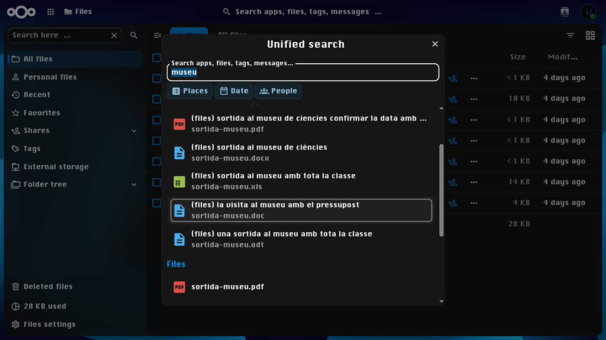
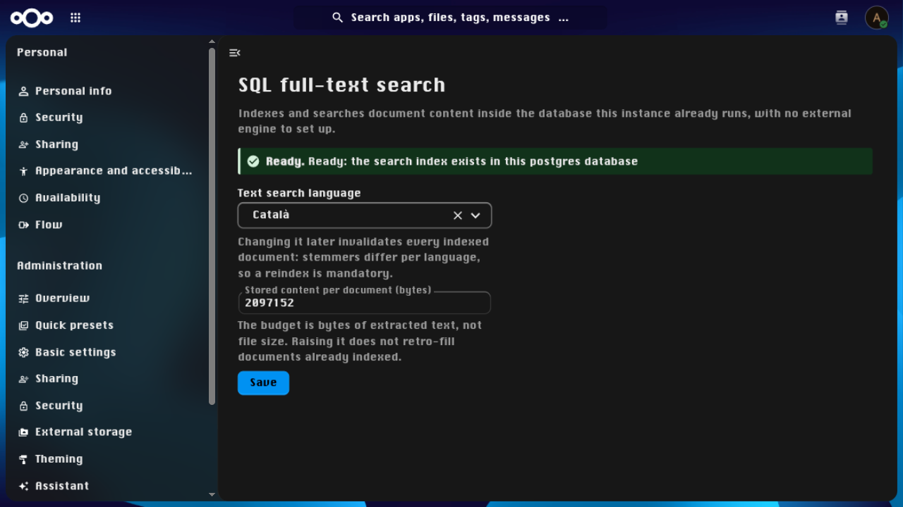

<!--
SPDX-FileCopyrightText: 2026 Néfix Estrada

SPDX-License-Identifier: AGPL-3.0-or-later
-->

# FTS SQL

[](https://api.reuse.software/info/github.com/nefixestrada/fts_sql)
[](https://github.com/nefixestrada/fts_sql/actions/workflows/phpunit-sqlite.yml)

A full text search platform for the [`fulltextsearch`][fts] framework that
indexes into the database the Nextcloud instance already runs — PostgreSQL,
MySQL/MariaDB or SQLite — so nobody has to operate Elasticsearch to get full
text search.

[fts]: https://github.com/nextcloud/fulltextsearch

## Screenshots

Content search in the unified search — the extracted text is what matches,
not just file names (the demo account's seven `museu` documents):



The admin card, in the framework's own Full text search settings section:



## Supported formats

| Format | What is indexed |
| --- | --- |
| Plain text — `.txt`, `.md`, `.csv`, `.log` and every extension nobody declared otherwise | the content as-is |
| Documents — OOXML, ODF, PDF and legacy Office (`.docx`, `.xlsx`, `.pptx`, `.odt`, `.ods`, `.odp`, `.pdf`, `.doc`, `.xls`, `.ppt`) | the body text |
| Everything else — `.epub`, archives, executables, images, audio and video | title, access and tags only |

## Requirements

- Nextcloud 34 with PHP 8.2 — the floors the integration matrix
  measures; the manifest pins the majors the app has been tested on.
- One of PostgreSQL 14+, MySQL/MariaDB, or SQLite built with the FTS5
  extension (the standard distributions' builds carry it; the app probes
  and says so when it is missing).
- The [`fulltextsearch`][fts] framework app and its `files_fulltextsearch`
  files provider.

## Installation

1. Install **fulltextsearch**, **files_fulltextsearch** and **FTS SQL**
   (app id `fts_sql`) from the Nextcloud app store, or with occ:

   ```console
   $ occ app:install fulltextsearch
   $ occ app:install files_fulltextsearch
   $ occ app:install fts_sql
   ```

   Enabling FTS SQL runs its migrations and creates the per-engine search
   artefacts.
2. Select FTS SQL as the search platform — on the admin card above
   (Administration → Full text search), or:

   ```console
   $ occ config:app:set fulltextsearch search_platform \
       --value 'OCA\FtsSql\Platform\SqlPlatform'
   ```

3. Fill the index and try it:

   ```console
   $ occ fulltextsearch:index -r
   $ occ fulltextsearch:test   # the framework's own smoke test
   ```

After changing the `language` setting or a failed run, the remedy is
always `occ fulltextsearch:reset` (it asks for confirmation) followed by
another index run.

Removing the app leaves its data — including a plaintext copy of every
indexed document — in place; [docs/admin.md](docs/admin.md) covers the
clean removal and what an upgrade of the Nextcloud server touches.

## Documentation

- [DESIGN.md](DESIGN.md) — the architecture and the decisions behind it,
  with the measurements that picked them.
- [docs/admin.md](docs/admin.md) — uninstalling cleanly, upgrading
  Nextcloud.
- [docs/development.md](docs/development.md) — the toolchain and the
  development instance.
- [docs/testing.md](docs/testing.md) — the test suites and the local
  engine matrix.
- [docs/ci.md](docs/ci.md) — the CI workflow set and its automation.
- [docs/vendoring.md](docs/vendoring.md) — the php-scoper bundling
  pipeline.
- [docs/benchmark.md](docs/benchmark.md) — the benchmark stages and
  today's numbers.
- [docs/releasing.md](docs/releasing.md) — building and signing the
  release tarball.
- [docs/translations.md](docs/translations.md) — the translation flow.

## Support

- [Bug reports and feature requests](https://github.com/nefixestrada/fts_sql/issues)
- [Questions and usage help](https://github.com/nefixestrada/fts_sql/discussions)

## Maintainers

- [Néfix Estrada](https://github.com/NefixEstrada) — see
  [AUTHORS.md](AUTHORS.md)

## Made with AI

The design, code, tests and documentation in this repository were
written with an AI coding agent, directed and reviewed by the
maintainer.

## Development

Work happens inside the Nix flake against a nextcloud-docker-dev
instance: [docs/development.md](docs/development.md) sets it up,
[docs/testing.md](docs/testing.md) runs every suite, and
[docs/ci.md](docs/ci.md) explains what CI checks. Contributions are
welcome — commit subjects read `type: sentence`, and measurements beat
adjectives.

## License

AGPL-3.0-or-later — see [LICENSES/](LICENSES).
